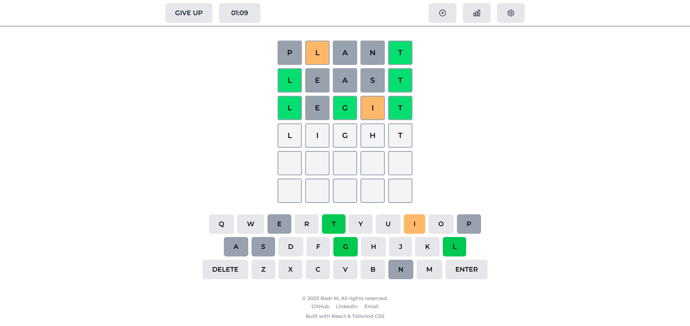
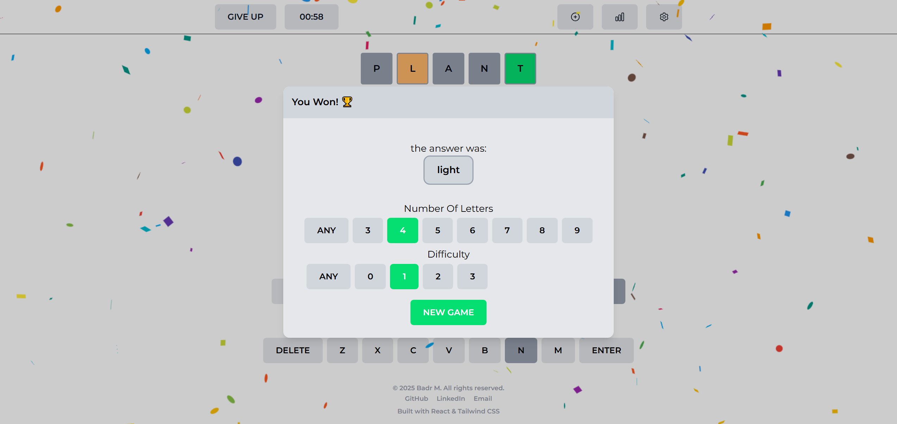
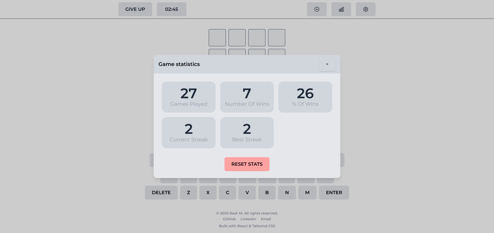

# Word Guesser

A full-stack word guessing game inspired by Wordle, built with a Spring Boot backend and a React + Tailwind CSS frontend, Dockerized for easy setup and deployment.

## Preview







## Features

- Fully featured Wordle-inspired gameplay and mechanics 
- Session-based game state - each game has a unique session ID that can be accessed from any device
- Custom games - create and share challenges with friends
- Session persistence - game state survives page refreshes and accidental closures  
- Adjustable difficulty - customize word length and difficulity to match your skill level
- Game statistics - track your win/loss performance in a dedicated statistics window

## Tech Stack

- **Frontend:** React, Tailwind CSS
- **Backend:** Spring Boot (Java)
- **Build & Deployment:** Docker, Docker Compose

## How to Run

1. **Install** [Docker Compose](https://docs.docker.com/compose/install/).
2. **Clone** the repository:

    ```bash
    git clone https://github.com/badr540/Word-Guesser.git
    cd Word-Guesser
    ```
3. **Start** the application:

    ```bash
    docker-compose up --build
    ```
4. **Play** the game:  
   Open [http://localhost:8080](http://localhost:8080) in your browser.

## Disclaimer

This project is built for learning and showcasing purposes only.
